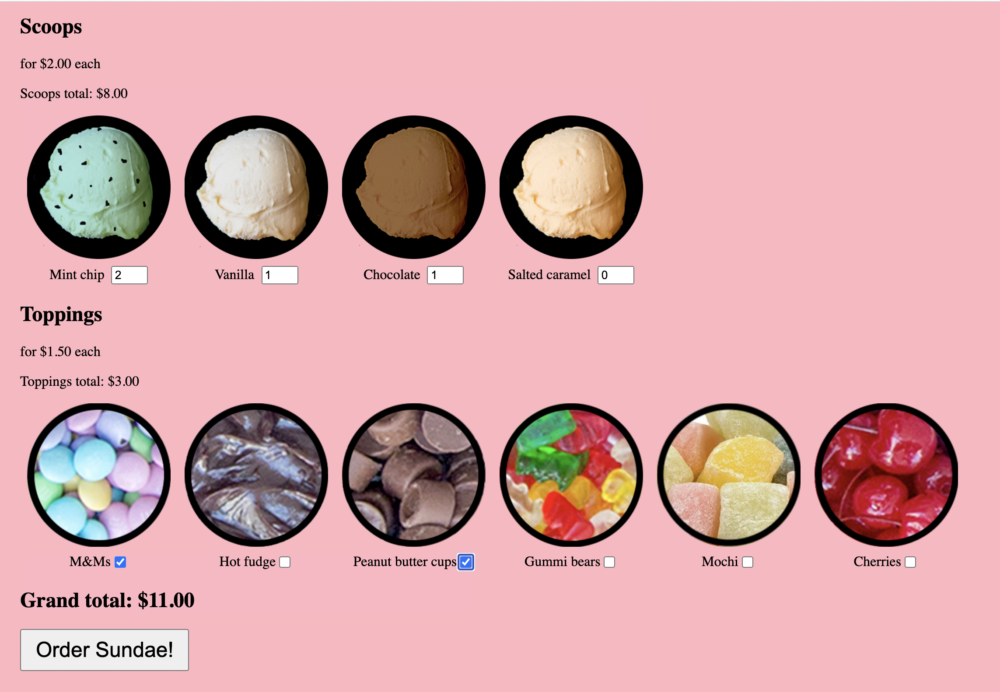
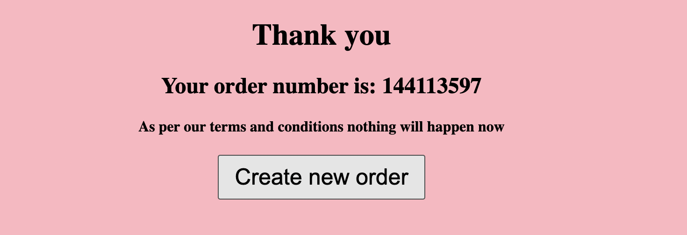

# Jest React Testing Library Demo

## Description

This is a simple 3-step application in which you can build and order your own ice cream sundae.

## Images

## Notes

I built this app while going through [Bonnie Schulkin's Testing React with Jest and Testing Library course](https://www.udemy.com/course/react-testing-library/) on Udemy.

Perhaps half of the course was theory, lectures, and "follow along" lessons while the other half of the course consisted of various coding challenges.

If you're going through the course yourself and referring to my code, please note that Bonnie used [React Bootstrap](https://react-bootstrap.netlify.app/) to style her components whereas I just used SASS/SCSS.

While both methods of styling are fine, there are a couple scenarios in which how you style your components may change how you approach testing your components. Just an FYI! :D

## Commands

### Running the App

After installing its dependencies using

> npm install

You can run this app by running:

> npm start

Please note, however, that you may receive some errors if you try running this app without also locally running the [server code that accompanies it](https://github.com/bonnie/udemy-TESTING-LIBRARY/tree/main/sundae-server).

### Launching the Test Runner

You can launch the test runner in the interactive watch mode with the following command:

> npm test
